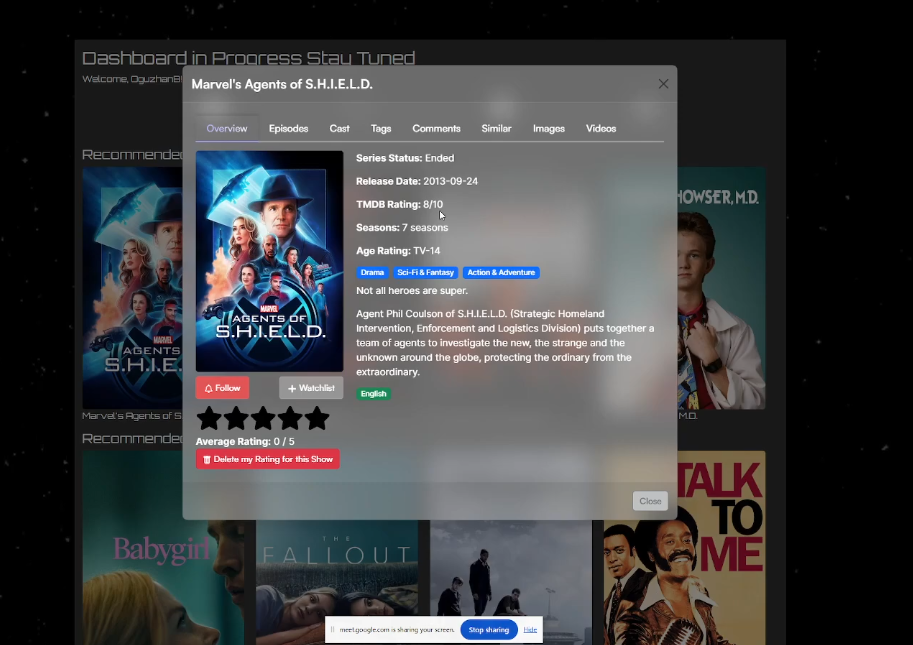

# Hello welcome to my profile!

💻 Software Engineer & Embedded Systems Enthusiast 
📍 Long Island, NY

---

## 🚀 Featured Projects

### 📺 Teleshow (React + Flask)

- Full-stack web app
- Firebase Authentication

- Real-time API integration (TMDB + Watchmode)
- User favorites, reviews, trailers

### 🔐 RFID Access Control System (RFID, Keypad, EEPROM)

- Multi-factor authentication (PIN + RFID)
- MFRC522 RFID module
- 4x4 Keypad input handling
- Servo-controlled gate mechanism

- Green/Red LED status indicators
- Audio feedback via passive buzzer
- Modular firmware structure
- Full wiring schematic documented

### 📊 Bond Market Liquidity Analysis
- Python (pandas, numpy, matplotlib)
- SQLite database
- ETF return analysis + correlations

